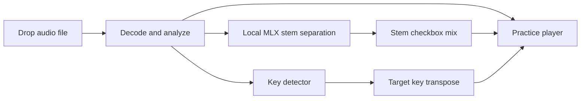

# By Ear Mac App

## Problem

Musicians need a private desktop practice tool that accepts local audio or YouTube audio, separates useful practice stems when possible, slows passages without pitch drift, loops exact regions, and transposes the recording into a chosen key.

## Goals / Non-goals

- Goals: macOS app, MP3/FLAC/WAV import, selectable practice stems, pitch-preserving speed from 0.1x to 1.5x, A-B loop selection, Repshed-style keyboard transport, detected key, target-key transpose.
- Goals: local-first processing so low-volume use is free after dependency install.
- Non-goals: App Store sandboxing, cloud account flow, notation generation, chord transcription, polyphonic note transcription.
- Non-goals: guaranteed perfect stem isolation. The chosen free local models are useful but can bleed.

## Evidence

| Source | Evidence | Impact |
|---|---|---|
| `tmp/repshed/README.md` | Repshed exposes A-B loop, 0.1x-2x pitch-preserved speed, waveform, fine adjust, keyboard shortcuts. | Match the fast practice workflow and shortcut muscle memory. |
| `tmp/repshed/js/tune.js` | Shortcuts are Space, arrows, `[`, `]`, `L`, `-`, `+`. | Implement the same core keys in the macOS app. |
| Local `mlx-audio-separator --list_models` | The catalog includes `BS-Roformer-SW.ckpt`, `vocals_mel_band_roformer.ckpt`, Kuielab bass, and Kuielab drums models. | Use MLX as the local stem engine with specialist models per stem. |
| `mlx-audio-separator --custom_output_names` | Output filenames can be made deterministic. | Write predictable `piano.wav`, `vocals.wav`, `bass.wav`, and `drums.wav` files before checkbox mixing. |
| Official Modal pricing page, checked 2026-06-26 | Starter plan advertises $30/month free credits. | Modal remains a later optional accelerator, not required for v1. |

## Approaches

| # | Approach | Pros | Cons |
|---|---|---|---|
| A | Native SwiftUI + AVFoundation + local MLX CLI | Small app, native file/drop integration, free offline playback, no bundled browser runtime. | Model install is external and first-run downloads can be slow. |
| B | Tauri/WebAudio + shell MLX | Browser-like waveform work is easy, small-ish bundle. | Rust/Tauri setup overhead in an empty repo; mac audio engine less native. |
| C | Electron + WebAudio + shell MLX | Fast UI development. | Heavy runtime for a minimalist Mac tool. |
| D | SwiftUI + hosted separation backend | Fast GPU separation for low volume within free credits. | Requires account, uploads private audio, and pricing can change. |

## Recommendation

Build Approach A. The product center is an on-device practice player; AVFoundation owns speed and pitch, SwiftUI owns the minimalist Mac surface, and MLX is the local stem engine the app can install into a user-local virtualenv.

## Open Questions

- None blocking for v1. If electric piano quality remains the bottleneck, keep MVSep Digital Piano as the optional specialist path and evaluate better MLX keys models as they appear.
