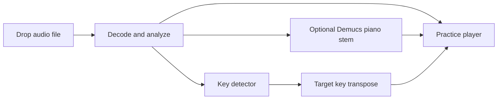

# By Ear Mac App

## Problem

Musicians need a private desktop practice tool that accepts local audio or YouTube audio, isolates piano when possible, slows passages without pitch drift, loops exact regions, and transposes the recording into a chosen key.

## Goals / Non-goals

- Goals: macOS app, MP3/FLAC/WAV import, piano stem action, pitch-preserving speed from 0.1x to 1.5x, A-B loop selection, Repshed-style keyboard transport, detected key, target-key transpose.
- Goals: local-first processing so low-volume use is free after dependency install.
- Non-goals: App Store sandboxing, cloud account flow, notation generation, chord transcription, polyphonic note transcription.
- Non-goals: guaranteed perfect piano isolation. The chosen free model is usable but known to bleed.

## Evidence

| Source | Evidence | Impact |
|---|---|---|
| `tmp/repshed/README.md` | Repshed exposes A-B loop, 0.1x-2x pitch-preserved speed, waveform, fine adjust, keyboard shortcuts. | Match the fast practice workflow and shortcut muscle memory. |
| `tmp/repshed/js/tune.js` | Shortcuts are Space, arrows, `[`, `]`, `L`, `-`, `+`. | Implement the same core keys in the macOS app. |
| `tmp/demucs/README.md` | `htdemucs_6s` adds `piano` and `guitar`; README warns piano quality is imperfect. | Use it as the free local path, with honest status copy. |
| `tmp/demucs/demucs/separate.py` and installed PyPI Demucs 4.0.1 | `--two-stems STEM` validates against the selected model sources; PyPI 4.0.1 does not expose `--other-method`. | Run `htdemucs_6s --two-stems piano` and load only `piano.wav`. |
| Official Modal pricing page, checked 2026-06-26 | Starter plan advertises $30/month free credits. | Modal remains a later optional accelerator, not required for v1. |

## Approaches

| # | Approach | Pros | Cons |
|---|---|---|---|
| A | Native SwiftUI + AVFoundation + local Demucs CLI | Small app, native file/drop integration, free offline playback, no bundled browser runtime. | Demucs install is external and CPU separation can be slow. |
| B | Tauri/WebAudio + shell Demucs | Browser-like waveform work is easy, small-ish bundle. | Rust/Tauri setup overhead in an empty repo; mac audio engine less native. |
| C | Electron + WebAudio + shell Demucs | Fast UI development. | Heavy runtime for a minimalist Mac tool. |
| D | SwiftUI + Modal Demucs backend | Fast GPU separation for low volume within free credits. | Requires account, uploads private audio, and pricing can change. |

## Recommendation

Build Approach A. The product center is an on-device practice player; AVFoundation owns speed and pitch, SwiftUI owns the minimalist Mac surface, and Demucs is an optional local tool the app can install into a user-local virtualenv.

## Open Questions

- None blocking for v1. If piano isolation quality becomes the bottleneck, evaluate Modal-hosted Demucs or an Apple Silicon MLX Demucs backend as a second pass.
